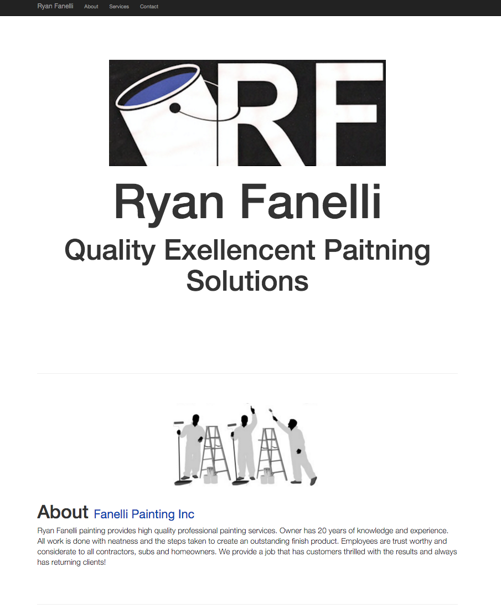
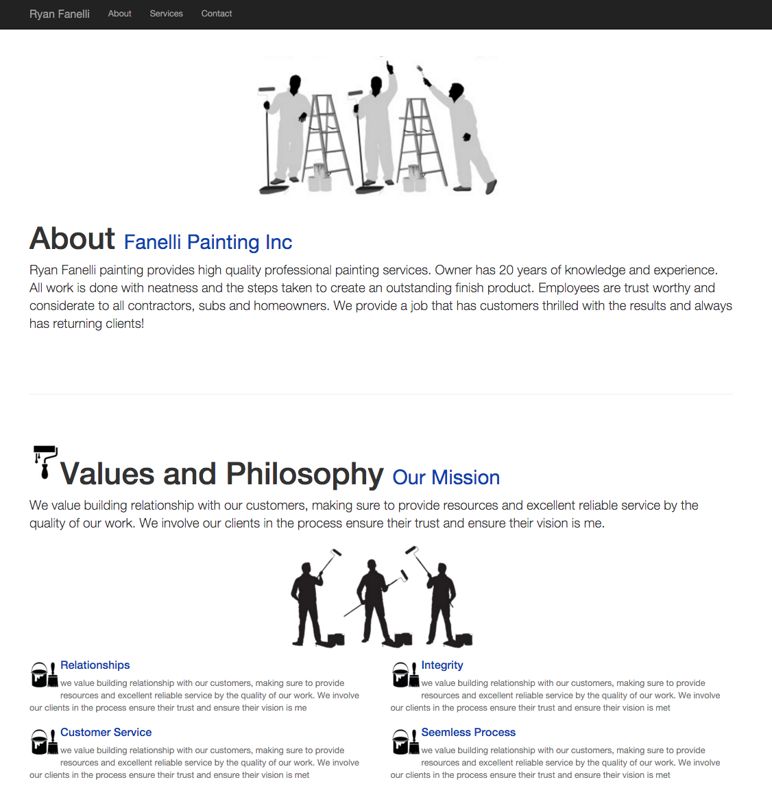

<h1>Project:</h1>

Ryan Fanelli Painting, Inc Business Website.
This is a one page responsive business web page for Rayns painting business. I used bootstrap to construct the layout. Added Ryan's logo and business colors to make site authentic to business and owner.

<h1>Techology Stack:</h1>
<ul>
<li>Python</li>
<li>Flask</li>
<li>HTML5</li>
<li>CSS3</li>
<li>Bootstrap</li>
<li>Github Pages</li>
<li>Name.com [DNS]</li>
<h1>Preview:</h1>
</ul>

<h4>Preview: Page Heading and Business Logo</h4>

<h4>Preview: Page content includes: about, values, services</h4>

